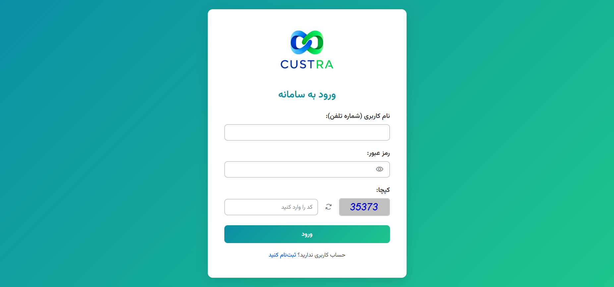
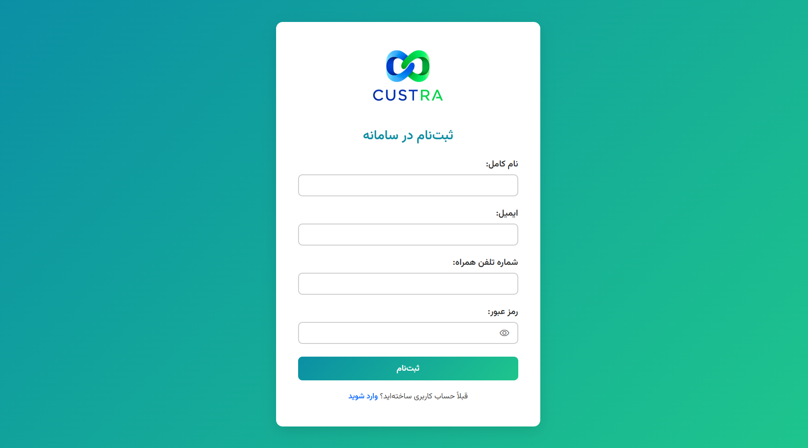

# Custra

## معرفی پروژه (فارسی)
**کاسترا** (مخفف Customer + Ultra) یک نمونه‌کار مدرن در حوزه‌ی **مدیریت ارتباط با مشتریان (CRM)** است.  
این پروژه نسخه‌ی ساده‌شده یک سامانه CRM محسوب می‌شود که با تمرکز بر طراحی رابط کاربری زیبا، توسعه‌ی سمت سرور قدرتمند و بهره‌گیری از **هوش مصنوعی** ساخته شده است.  

### ✨ ویژگی‌ها
- طراحی صفحات **HTML / CSS** مدرن، ریسپانسیو و کاربرپسند  
- تعاملات پویا با استفاده از **JavaScript**  
- پیاده‌سازی بک‌اند با **Java (Spring Boot)**  
- بهره‌گیری از **ChatGPT 5** برای طراحی فرانت‌اند و بک‌اند  
- طراحی لوگو با **Gemini**  
- ساختار ساده و مناسب برای یادگیری و گسترش  
- استفاده از معماری تمیز و قابل توسعه  

### 🎯 هدف
هدف از توسعه‌ی Custra، نمایش توانایی در ترکیب **Front-End زیبا** و **Back-End حرفه‌ای** با استفاده از تکنولوژی‌های مدرن است.  
این پروژه بیشتر جنبه‌ی **نمونه‌کار (Portfolio Project)** دارد و می‌تواند به عنوان پایه‌ای برای یک CRM واقعی توسعه یابد.  

---

## Project Overview (English)

**Custra** (Customer + Ultra) is a modern **Customer Relationship Management (CRM)** sample project.  
It is designed as a simplified CRM system with a focus on a **beautiful UI**, a **powerful back-end**, and the use of **Artificial Intelligence**.  

### ✨ Features
- Modern, responsive **HTML / CSS** design  
- Interactive pages with **JavaScript**  
- Back-end built with **Java (Spring Boot)**  
- **ChatGPT 5** assisted in front-end and back-end design  
- Logo design created with **Gemini**  
- Simple and extendable project structure  
- Clean architecture for easy maintenance and growth  

### 🎯 Purpose
The main goal of Custra is to demonstrate skills in building a combination of a **modern front-end** and a **robust back-end** using popular technologies and AI.  
While simplified, this project can serve as a **portfolio showcase** or a **foundation for a full CRM system**.  

---

## 🛠️ Technologies | تکنولوژی‌ها
- Java  
- Spring Boot  
- HTML, CSS, JavaScript  
- Gradle-Kotlin  

---

### 🖥️ Development Tools | ابزارهای توسعه
- IntelliJ IDEA 2024.3.5  
- Visual Studio Code
  
---

### 📸 Screenshots | تصاویر)
## Login Page | صفحه ورود  


## Register Page | صفحه ثبت‌نام  


---

## 🚀 Getting Started
```bash
git clone https://github.com/your-username/custra.git
```


پس از اجرای پروژه، می‌توانید صفحات مختلف را در مرورگر باز کنید:

After running the project, you can open the following pages in your browser:

Login Page |  صفحه ورود
 → [Login page](http://localhost:8080/Custra/login)

Register Page | صفحه ثبت‌نام
 → [Registration page](http://localhost:8080/Custra/register)

Dashboard | داشبورد
 → [Main dashboard](http://localhost:8080/Custra/dashboard)
 
بر اساس نقش کاربر: مشتری یا پشتیبان هدایت می‌شود. اگر کاربر لاگین نکرده باشد به صفحه ورود منتقل می‌شود.

Automatically detects if the user is a customer or support agent. If not logged in, the user will be redirected to the login page.

---

## License

This project is licensed under the MIT License.  
© 2025 Mohammad Matin Kalantari

## Contact

Connect with me on LinkedIn: [M-M-Kalantari](https://www.linkedin.com/in/m-m-kalantari)
